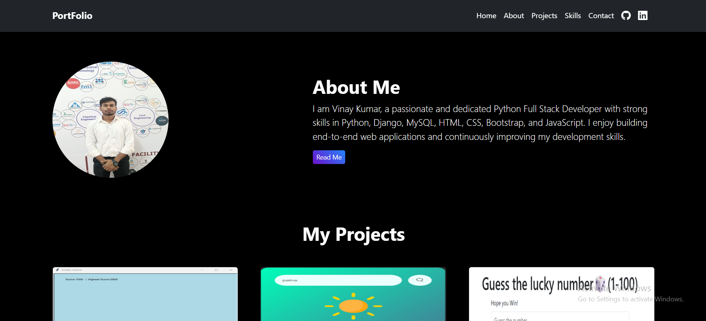
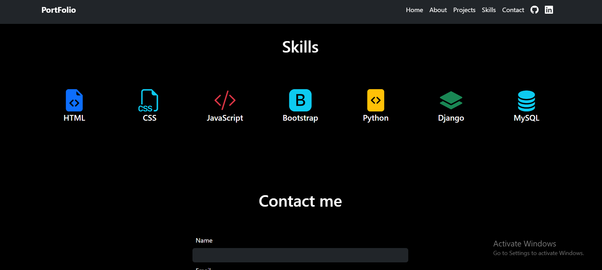

# Portfolio Website

A responsive and modern personal portfolio website built using HTML, CSS, JavaScript (and Bootstrap if included).  
This project showcases personal details, skills, projects, achievements, and contact information in a clean and professional layout.

---

## 🚀 Features

- Fully responsive design  
- Modern UI/UX  
- About Me section  
- Skills & Experience  
- Portfolio/Projects showcase  
- Contact form or contact details  
- Smooth animations and transitions  

---

## 🛠️ Technologies Used

- **HTML5**  
- **CSS3**  
- **JavaScript**  
- **Bootstrap 5** 
- **Font Awesome / Icons**  

---

📸 Screenshots

📬 Contact

If you want to connect or collaborate:

Name: Vinay Kumar
Email: your-vinaylkr2@gmail.com
GitHub: https://github.com/vinay829222

📜 License
This project is open-source and free to use.

